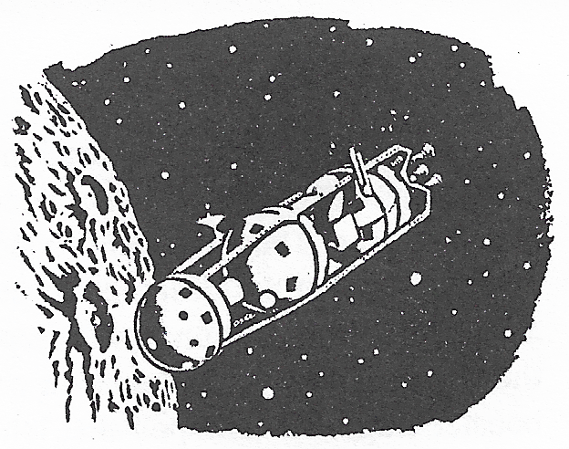
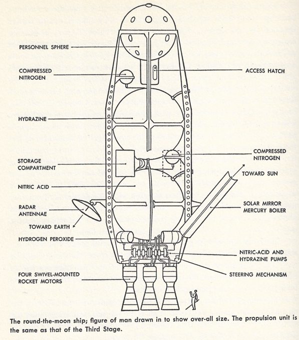
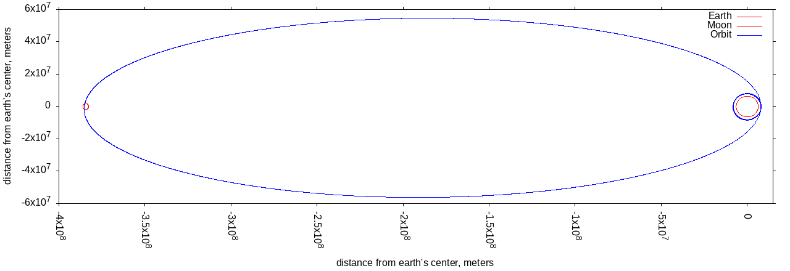

# Check Wehrner von Braun's circumlunar probe orbit



[Across the Space Frontier](https://space.nss.org/book-review-across-the-space-frontier/),
Joseph Kaplan, Wernher von Braun, Heinz Haber, Willey Ley, Oscar Schatchter, Fred Whipple,
edited by Cornelius Ryan, Viking Press, 1952.
part of a prose expostion,
and elaboration of von Braun's [The Mars Project](https://en.wikipedia.org/wiki/The_Mars_Project),
the technical appendix of [Project Mars](https://en.wikipedia.org/wiki/Project_Mars:_A_Technical_Tale),

Von Braun describes a lunar excursion,
to be undertaken as a way to ease into interplanetary travel,
and map the landing site for a lunar expedition.

## Vehicle Specs



Line drawing from _Across the Space Frontier_


Von Braun's own sketch, which includes a scale.

Unfortunately, von Braun did not see fit to numerically describe
the circumlunar vehicle as fully as he did the Three Stage Launch vehicle.
He does write:
"The propulsion unit is the same as that of the Third Stage".

The _PRINCIPAL DATA ON THE THREE_STAGE ROCKET SHIP_ table has these
relevant facts for the Third Stage:

* 220 ton thrust
* 0.77 ton/sec propellant consumption
* 9200 ft/sec exhaust velocity
* 286 sec I<sub>sp</sub>

In consistent SI units:

* Thrust 1.958E6 Kg m/s<sup>2</sup>
* Propellant consumption 700 kg/s
* Exhaust velocity 2805 m/s

There's a phrase in the book about leaving space station orbit requires "barely 2 minutes" of thrust.

From this, we can back out a total propellant consumption of 168,000 kg.
That's one 120 sec burn
to leave space station orbit, a very similar burn to circularize the eccentric
cislunar orbit.

Von Braun also gives a &#916;V requirement of 2835 m/s
to leave the space station's 1075-mile orbit,
getting into an orbit whose apogee is just outside the moon's orbit.

From these facts and the [Rocket Equation](),
we can back out a fully fueled mass of 193652 kg,
and a vehicle dry mass of 25652 kg.

## Orbit Diagram


This is the orbit as presented in _Across the Space Frontier_.
It's a bit confusing since it presents the vehicle's trans-lunar orbit
in the same plane as the space station's orbit and the moon's orbit.

## A Program for Verifying the Orbit

In accordance with [Gall's Law](http://principles-wiki.net/principles:gall_s_law),
I'm going to start small and work my way up to the hard tasks.
In the process, I intend to learn a little about numerical integration,
and refresh my 40-year-old knowledge of orbital mechanics.

Here's my project plan:

1. Numerically integrate a rocket thrusting for a period.
Double check that the change in velocity matches the Rocket Equation.
   * Wrote a [simulation](csm.go) based on the Apollo Command/Service module,
   since that's very well documented numerically.
2. Numerically integrate a circular orbit. That is,
using (vector) **F** = m **A**, where acceleration **A**
always points to the center of the earth, see if an object with
tangential velocity of 7069.5 meters/sec ends up in a 1075 mile circular orbit.
   * Wrote a [simulation](ss.go) of Wernher von Braun's polar-orbiting
   space station from _Across the Space Frontier_, using [symplectic Euler](https://en.wikipedia.org/wiki/Semi-implicit_Euler_method)
   numerical integration, 0.25 second time steps
     * orbit height 1730044.745 m (1075 mile), 7012.6 m/s velocity
     * Numerically integrates a nice, 7258 second circular orbit,
       orbital radius staying between 8100234 m and 8101993 m
   * Ran a long-period (230 days) [simulation](long_period1.go) of Wernher von Braun's polar-orbiting
     space station to see if numeric integration lost or gained energy due to
     numerical problems. It does not.
3. After one orbit, apply an impulsive velocity change,
determine if **F** = m **A** integration of earth's gravity
causes the vehicle to change to an elliptic orbit.
   * Wrote a simulation of von Braun's lunar excursion vehicle
   doing a 1000 meter/sec impulsive velocity change, again using symplectic Euler
   numerical integration.
     * perigee of 1730044.745 m (1075 mile), 8012.6 m/s velocity after the impulsive &#916;V
     * [vis viva](https://en.wikipedia.org/wiki/Vis-viva_equation) equation works out to an apogee of 1.523x10<sup>7</sup> m,
       numerically integrated orbit hits that exactly.
4. After one orbit, apply a non-impulsive velocity change,
determine if **F** = m **A** integration of earth's gravity
causes the vehicle to change to an elliptic orbit.
Use the same 1000 meter/sec &#916;V as in (3).
   * Simulated an [impulsive](impulse1.go) and a [nonimpulsive](nonimpulsive1.go) 1000 meter/second velocity change.
     Had to tinker with the timing of the nonimpulsive burn to get the two orbits to overlap.
5. Try numeric integration of a [Hohmann transfer orbit](https://en.wikipedia.org/wiki/Hohmann_transfer_orbit).
This requires two impulsive velocity changes.
   * Simulated an [impulsive](impulse2.go) and a [nonimpulsive](nonimpulsive2.go) two-burn solution.
6. See if a "barely 2 minute" continuous thrust and concomitant mass change
numerically integrates to a big ellipse that takes the vehicle
out to the radius of the Moon's orbit.
   * Got that [simulated](circularize.go). The vehicle pretty much drains its
     propellant tanks to circularize back to the 1075 mile high space station orbit.
     It also takes a 172 second burn to get into the trans-lunar orbit.
7. Try to put a 3rd body, the Moon, into the simulation of (5).
   * I did not do this due to the confusing orbit diagram.
     I think the moon's orbit is perpendicular to the vehicle's orbit,
     but nothing in the book says that.



Above is a simulation of an approximately to-scale 1075 mile orbit,
followed by a simulated, nonimpulsive (continuous thrust and mass change) burn
to increase velocity by 2721.34 meters/sec.
The burn ends up lasting 172.25 seconds,
which is much more like three minutes than "scarcely two".
The burn also starts 212.250 seconds after the impulsive version happens,
so as to align apogee with the X-axis of the plot.

After coasting for 10.04 days, simulate a second, nonimpulsive burn to circularize
the highly elliptical trans-lunar orbit back to 1075 mile high space station orbit.

There are to-scale earth and moon sized circles in the diagram.
The moon-sized circle is to visually evaluate if the vehicle gets out to where
the moon would be - I included no lunar gravity in the simulation.

I believe this makes the case that the vehicle von Braun outlined could
make it out to the moon and back.
Except I simulated an orbit confined to the ecliptic.
Von Braun had the vehicle leaving from a space station in a (nearly) polar orbit.

## Building and Running the Simulations

After cloning this repo, you should be able to do something like this:

```
$ make build
... view all the generated PNG files
$ make clean
```

PNG file `orbits_overlay.png` overlays my impulsive and nonimpulsive 1000 m/s
velocity changes.
PNG file `hohmann_overlay.png` overlays  impulsive and nonimpulsive 1000 m/s
velocity changes, followed by circularizing to a higher altitude orbit.
I tinkered with timing of the nonimpulsive burns relative to the impulsive
velocity changes to get the pairs of simulations to overlay closely.
I couldn't find any orbital mechanics heuristics to help me with the tinkering.

## Symplectic Euler Method

All of my numerical integrations work like this:

Start simulation where vehicle has some position (X,Y) relative
to center of the earth, and a vector velocity (V<sub>x</sub>,V<sub>y</sub>)
All motion constrained to plain of ecliptic, there are no Z components of anything.
I'm assuming a known, constant thrust and constant mass flow rate for the
rocket engines.

```
for t := t0; t < tmax; t += Δt {

    // find distance from center of earth, which is at (0.0,0.0)
    r = √(X*X + Y*Y)

    // magnitude of attraction due to gravity
    Fgrav = G Mearth/(r*r)

    // X and Y direction components
    // of gravitational forces
    Fx = (-X/r)Fgrav
    Fy = (-Y/r)Fgrav

    // Vector components of thrust
    // assumed tangential to orbit
    V = √(Vx*Vx + Vy*Vy)
    Fx = Thrust Vx/V
    Fy = Thrust Vy/V

    // constant mass flow, so ΔM does depend on length of time step
    // Mass change for time step
    M -=  ΔM

    // Vector acceleration components
    Ax = Fx/M
    Ay = Fy/M

    // Increment velocity components
    Vx += Ax Δt
    Vy += Ay Δt

    // Increment position components
    X += Vx Δt
    Y += Vy Δt
}
```
Ultimately, the numerical integration results from observing that
Newton's Second law is actually `F = d(Mv)dt`.
Since a rocket gets thrust from throwing mass away at high velocity,
the `Mv` term doesn't simplify to `M dv/dt` or `MA`.
Considering the effects of gravity further complicates things.

I could not find any intermediate expositions on this,
or any intermediate software,
only impulsive manuever equations,
calculus-heavy [NASA documents](https://ntrs.nasa.gov/citations/19630011221)
from the 1960s,
and advanced orbital mechanics software like [42](https://github.com/ericstoneking/42).

## References

* [Symplectic Euler method](https://www.mgaillard.fr/2021/07/11/euler-integration.html)
* [Earth and Moon facts](https://nssdc.gsfc.nasa.gov/planetary/factsheet/moonfact.html)
