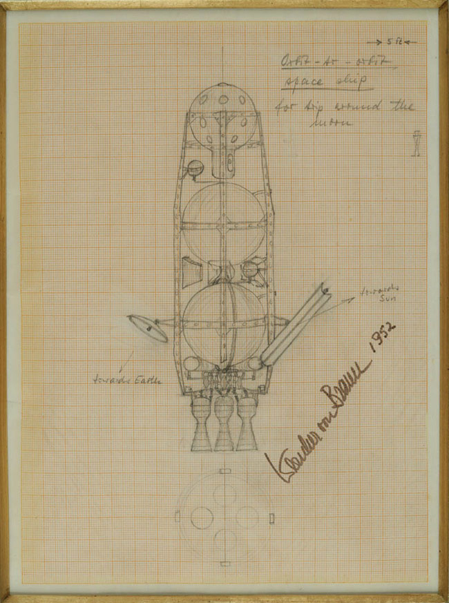

# Check Wehrner von Braun's circumlunar probe orbit

[Across the Space Frontier](https://space.nss.org/book-review-across-the-space-frontier/),
Joseph Kaplan, Wernher von Braun, Heinz Haber, Willey Ley, Oscar Schatchter, Fred Whipple,
edited by Cornelius Ryan, Viking Press, 1952.
part of a prose expostion,
and elaboration of von Braun's [The Mars Project](https://en.wikipedia.org/wiki/The_Mars_Project),
the technical appendix of [Project Mars](https://en.wikipedia.org/wiki/Project_Mars:_A_Technical_Tale),

Von Braun describes a lunar excursion,
to be undertaken as a way to ease into interplanetary travel,
and map the landing site for a lunar expedition.

## Vehicle Specs

Line drawing from _Across the Space Frontier_

Von Braun's own sketch, which includes a scale.

Unfortunately, von Braun did not see fit to numerically describe
the circumlunar vehicle as fully as he did the Three Stage Launch vehicle.
He does write:
"The propulsion unit is the same as that of the Third Stage".

The _PRINCIPAL DATA ON THE THREE_STAGE ROCKET SHIP_ table has these
relevant facts for the Third Stage:

* 220 ton thrust
* 0.77 ton/sec propellant consumption
* 9200 ft/sec exhaust velocity
* 286 sec Isp

In consistent SI units:

* Thrust 1.958E6 Kg m/s2
* Propellant consumption 700 kg/s
* Exhaust velocity 2805 m/s

There's a phrase in the book about leaving space station orbit requires "barely 2 minutes" of thrust.

From this, we can back out a total propellant consumption of 168,000 kg.
That's one 120 sec burn
to leave space station orbit, a very similar burn to circularize the eccentric
cislunar orbit.

Von Braun also gives a &#916;V requirement of 2835 m/s
to leave the space station's 1075-mile orbit,
getting into an orbit whose apogee is just outside the moon's orbit.

From these facts and the [Rocket Equation](),
we can back out a fully fueled mass of 193652 kg,
and a vehicle dry mass of 25652 kg.

## Orbit Diagram

## A Program for Verifying the Orbit

In accordance with [Gall's Law](http://principles-wiki.net/principles:gall_s_law),
I'm going to start small and work my way up to the hard tasks.
In the process, I intend to learn a little about numerical integration,
and refresh my 40-year-old knowledge of orbital mechanics.

Here's my project plan:

1. Numerically integrate a rocket thrusting for a period.
Double check that the change in velocity matches the Rocket Equation.
   * Wrote a [simulation](csm.go) based on the Apollo Command/Service module,
   since that's very well documented numerically.
2. Numerically integrate a circular orbit. That is,
using (vector) **F** = m **A**, where acceleration **A**
always points to the center of the earth, see if an object with
tangential velocity of 7069.5 meters/sec ends up in a 1075 mile circular orbit.
   * Wrote a [simulation](ss.go) of Wernher von Braun's polar-orbiting
   space station from _Across the Space Frontier_, using [symplectic Euler](https://en.wikipedia.org/wiki/Semi-implicit_Euler_method)
   numerical integration, 0.25 second time steps
     * orbit height 1730044.745 m (1075 mile), 7012.6 m/s velocity
     * Numerically integrates a nice, 7258 second circular orbit,
       orbital radius staying between 8100234 m and 8101993 m
3. After one orbit, apply an impulsive velocity change,
determine if **F** = m **A** integration of earth's gravity
causes the vehicle to change to an elliptic orbit.
   * Wrote a simulation of von Braun's lunar excursion vehicle
   doing a 1000 meter/sec impulsive velocity change, again using symplectic Euler
   numerical integration.
     * perigee of 1730044.745 m (1075 mile), 8012.6 m/s velocity after the impulsive &#916;V
     * [vis viva](https://en.wikipedia.org/wiki/Vis-viva_equation) equation works out to an apogee of 1.523x107 m,
       numerically integrated orbit hits that exactly.
4. After one orbit, apply a non-impulsive velocity change,
determine if **F** = m **A** integration of earth's gravity
causes the vehicle to change to an elliptic orbit.
Use the same 1000 meter/sec &#916;V as in (3).
5. Try numeric integration of a [Hohmann transfer orbit]() works.
This requires two impulsive velocity changes.
6. See if a "barely 2 minute" continuous thrust and concomitant mass change
numerically integrates to a big ellipse that takes the vehicle
out to the radius of the Moon's orbit.
7. Try to put a 3rd body, the Moon, into the simulation of (5).

## References

* [Symplectic Euler method](https://www.mgaillard.fr/2021/07/11/euler-integration.html)
* [Earth and Moon facts](https://nssdc.gsfc.nasa.gov/planetary/factsheet/moonfact.html)
